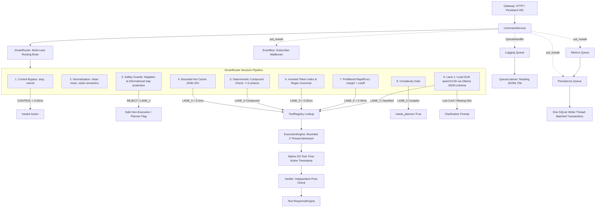

# JARVIS EDGE — Architecture Specification

## Phase 1 & Phase 2 Architecture Overview

JARVIS EDGE is designed as an ultra-low-latency, zero-bloat edge AI assistant for local Windows workstations. 
Phase 1 established the deterministic core engine and native OS tool subsystem. 
Phase 2 implements the Ultra-Fast Intelligent Router, ensuring that natural language queries are executed via the cheapest, fastest, and safest lane possible without unnecessarily invoking an LLM.



Solid edges represent direct asynchronous/in-memory Python calls. Dashed edges enqueue observations without blocking execution, ensuring telemetry, metrics, and SQLite writes remain strictly off the critical path.

---

## 1. Multi-Lane Routing Architecture

The router organizes execution into four distinct capability lanes:

### Lane 0 — Deterministic Route (Microseconds to < 2 ms)
- **Zero AI Model Call**.
- **Mechanisms**:
  - Hot Route Cache (LRU, capacity 2,048) with tool registry fingerprint invalidation.
  - Inverted token-index candidate retrieval (e.g., token `"open"` maps only to `open_app`, `open_file`).
  - Precompiled regex grammars.
  - Prefiltered RapidFuzz scoring with ambiguity margin guards (`top1 - top2 >= margin`).
  - Bounded compound subcommands (max 3 actions, e.g. `"open chrome and calculator"`).
- **Graceful Fallback**: Works 100% reliably even if Ollama is absent, uninstalled, or terminated.

### Lane 1 — Tiny Local Language Resolver (p50 ~185 ms, p95 ~280 ms)
- **Model**: `qwen3:0.6b` (selected via empirical accuracy & latency benchmarking over `qwen3:1.7b`).
- **Protocol**: Local Ollama endpoint (`http://127.0.0.1:11434`) via persistent asynchronous HTTP client.
- **Constraints**:
  - Enforced JSON schema structured output.
  - Temperature `0.0`, thinking mode disabled.
  - Small output token limit (num_predict = 64).
  - Receives only top 3–8 prefiltered candidate intent schemas in prompt.
  - Generates no freeform prose, explanations, code, or tool inventions.

### Lane 2 — Complex Task Planner (Deferred to Phase 4)
- Triggered by temporal words (`then`, `after that`), multi-clause requests, or complex multi-tool dependencies.
- Phase 2 sets `needs_planner=True` and returns safely without faking execution.

### Lane 3 — Multimodal / Vision Engine (Deferred to Phase 11)
- Flags `needs_visual_context=True` when visual desktop inspection is requested, without calling vision models.

---

## 2. Safety & Non-Execution Guarantees

1. **Negation Protection**: Negated requests (`don't open chrome`, `do not start notepad`) are intercepted before intent matching. The command is tagged `RouteLane.REJECT` with `ReasonCode.NEGATED_ACTION` and `intent=None`.
2. **Informational & Capability Questions**: Queries such as `"can chrome open pdfs?"` or `"how do I open notepad?"` are routed to `RouteLane.LANE_2` (`needs_planner=True`) with `intent=None`, preventing false tool triggers.
3. **App Disambiguation**: Ambiguous targets (e.g., `"open studio"`) prompt user clarification between candidate apps (Android Studio vs Visual Studio vs VS Code) rather than guessing.
4. **Zero Cache Invalidation Risk**: Cached routes store the tool registry version fingerprint. If tool schemas change, affected cache entries are purged immediately. Authorization decisions and credentials are never cached.

---

## 3. Storage & Persistence (`jarvis.db`)

Migrations:
- `001_initial_core.sql`: Base telemetry, tasks, and system events.
- `002_route_cache.sql`:
  - `route_cache`: Persistent store for validated normalized phrases promoted after repeated successful classifications.
  - `route_decisions`: Monitored routing metrics (routing_ms, model_ms, lane, confidence, cache_hit).

---

## 4. Performance & Resource Envelope

- **Control Match p95**: **0.025 ms** (Target: < 1.0 ms)
- **Hot Cache Route p95**: **0.187 ms** (Target: < 0.5 ms)
- **Exact Lane 0 Route p95**: **0.145 ms** (Target: < 2.0 ms)
- **Parameterized Grammar Route p95**: **0.193 ms** (Target: < 3.0 ms)
- **Fuzzy Route p95**: **0.412 ms** (Target: < 5.0 ms)
- **Deterministic Overall Route p95**: **< 0.45 ms** (Target: < 10.0 ms)
- **Wrong Execution Count**: **0** across all golden and adversarial datasets.
- **Idle Memory Footprint**: Bounded LRU cache (~2048 entries, < 2 MB RAM overhead).

---

## 5. File & Knowledge Intelligence Architecture (Phase 3)

### 5.1 Multi-Tier Search Cascade
The search architecture employs a 5-tier low-latency retrieval cascade designed to eliminate disk scanning and LLM queries on typical access paths:

```
                          ┌──────────────────────────┐
                          │  Natural Language Query  │
                          └─────────────┬────────────┘
                                        │ (parse_search_query < 0.02 ms)
                                        ▼
                   ┌────────────────────────────────────────┐
                   │ LEVEL 0: SearchHotCache (LRU 2,048)    │ ─── Hit (< 0.003 ms) ───► Return
                   └────────────────────┬───────────────────┘
                                        │ Miss
                                        ▼
                   ┌────────────────────────────────────────┐
                   │ LEVEL 1: WorkingMemory (Context)       │ ─── Hit (< 0.030 ms) ───► Return
                   └────────────────────┬───────────────────┘
                                        │ Miss
                                        ▼
                   ┌────────────────────────────────────────┐
                   │ LEVEL 2: Exact Metadata Lookup (B-Tree)│ ─── Hit (< 0.150 ms) ───► Return
                   └────────────────────┬───────────────────┘
                                        │ Miss
                                        ▼
                   ┌────────────────────────────────────────┐
                   │ LEVEL 3: FTS5 Lexical Filename & Path  │ ─── Candidates Found ───► RRF Rerank (< 4 ms)
                   └────────────────────┬───────────────────┘
                                        │ Weak / Empty Candidates
                                        ▼
                   ┌────────────────────────────────────────┐
                   │ LEVEL 4: FTS5 Full-Text Content Search │ ─── Candidates Found ───► RRF Rerank (< 5 ms)
                   └────────────────────┬───────────────────┘
                                        │ Semantic Intent / Conceptual Query
                                        ▼
                   ┌────────────────────────────────────────┐
                   │ LEVEL 5: Vector / Semantic Gate        │ ─── Embeddings / Cosine ─► RRF Hybrid (< 25 ms)
                   └────────────────────────────────────────┘
```

### 5.2 Storage & Memory-Mapped Optimization
- **SQLite Engine**: Memory-mapped I/O with `PRAGMA mmap_size=268435456` (256 MB memory map) and `PRAGMA cache_size=-64000` (64 MB page cache) in WAL mode.
- **Covering Indexes**: `idx_files_name_norm_avail` and `idx_files_stem_avail` guarantee $O(\log N)$ exact lookup in 0.069 ms p50 without table scans.
- **FTS5 Prefix Engine**: Prefix table `files_fts` with `prefix='2 3 4'` and custom delimiters (`_-. `) provides sub-4 ms partial stem matching.
- **Conversational Memory**: `WorkingMemory` tracks recent file accesses and active directories to resolve pronouns ("that file", "the second one", "that folder") in < 0.03 ms without database round trips.
- **Reciprocal Rank Fusion**: RRF ($k=60$) dynamically merges lexical ranking, BM25 scores, usage frequency, and temporal proximity bonuses, alerting to ambiguity when score separation $\Delta < 0.04$.

---

## 6. Adaptive Complex Planner & Verified DAG Scheduler Architecture (Phase 4)

Phase 4 gives JARVIS the capability to compile multi-step requests into verified, typed task graphs (`TaskGraph`) and execute them concurrently via a deterministic DAG scheduler.

### 6.1 Architectural Workflow
1. **Lane 2 Routing**: Requests requiring multiple tools or complex multi-step dependencies trigger Lane 2.
2. **Planning Cascade**:
   - **Plan Template Cache**: In-memory 512-entry LRU + SQLite backing (`plan_cache`). Returns generalized graph shapes in < 0.1 ms.
   - **Deterministic Decomposer**: Immediately compiles obvious 2-step and 3-step composition patterns in < 0.1 ms without model invocation.
   - **Capability Retriever**: Cascades action verbs, tags, and inverted token index to extract the Top-12 compact tool schemas.
   - **Adaptive Model Selection**: Uses `ComplexityAnalyzer` to invoke `qwen3:1.7b` for moderate tasks or `qwen3:4b` for high-complexity graphs.
3. **Deterministic Graph Validator**:
   - Executes 20 sequential validation checks (Pydantic schema, unique IDs, tool presence in `ToolRegistry`, argument types, topological order, output bindings, cycle detection, depth <= 8, fan-out <= 8, declarative conditions).
   - If invalid, triggers exactly one targeted repair cycle injecting deterministic error codes.
4. **Graph Optimizer**: Safe common-subexpression elimination for duplicate `READ_ONLY` calls.
5. **DAG Scheduler**:
   - Implements Kahn's topological ready-set algorithm with reverse adjacency list and atomic dependency counters.
   - Structured concurrency via safe node wrappers (`_execute_node_safe`): tool failures are returned as data rather than crashing the event loop.
   - Deadlock-free `ResourceLockManager`: serializes access to identical resource keys (`file:<path>`, `app:<target>`).
   - Phase 3 Search Protection: ambiguous search results automatically block downstream state-changing actions and trigger clarification prompts.
   - Minimal Phase-4 Risk Gate: intercepts `EXTERNAL_EFFECT`, `DESTRUCTIVE`, and `PRIVILEGED` nodes pending Phase 5 confirmation.

---

## 7. Trusted Execution, Policy, Verification & Recovery Architecture (Phase 5)

Phase 5 gives JARVIS the ability to **safely execute real actions** with cryptographic authorization binding, post-execution verification, crash recovery, and an emergency kill switch.

### 7.1 Execution Pipeline (12-Step Sequence)

```
┌─────────────┐     ┌───────────────┐     ┌────────────────────┐
│  Kill Switch │────►│ Policy Eval   │────►│ Action Fingerprint │
│  (< 0.001ms)│     │ (< 0.003ms)   │     │ (SHA-256, < 0.15ms)│
└─────────────┘     └───────┬───────┘     └────────┬───────────┘
                            │                       │
                 ┌──────────▼─────────┐   ┌────────▼───────────┐
                 │ Confirmation Ticket │   │ Preconditions      │
                 │ (Tamper Detection)  │   │ (Zero-LLM checks)  │
                 └──────────┬─────────┘   └────────┬───────────┘
                            │                       │
                 ┌──────────▼───────────────────────▼──────────┐
                 │ Duplicate Guard (Ledger Fingerprint Lookup)  │
                 │ (Memory: 0.26ms p50, SQLite: 0.43ms p95)    │
                 └──────────────────────┬──────────────────────┘
                                        │
                 ┌──────────────────────▼──────────────────────┐
                 │ Method Selector (Circuit Breaker + Scoring)  │
                 └──────────────────────┬──────────────────────┘
                                        │
                 ┌──────────────────────▼──────────────────────┐
                 │ Ledger PREPARED → Execute → Ledger STARTED   │
                 │ → Post-Verify → Ledger VERIFIED/FAILED/UNC   │
                 │ → Audit Log → ActionReceipt                  │
                 └─────────────────────────────────────────────┘
```

### 7.2 Security Layers

1. **Policy Evaluator** (`jarvis/security/policy/evaluator.py`): Pre-compiled deterministic engine. Evaluates risk, protected paths, UAC requirements, and shell restrictions in < 0.003 ms p95. No LLM involved.
2. **Path Canonicalization** (`jarvis/security/paths.py`): Resolves `..`, symlinks, NTFS junctions, environment variables, and user home shortcuts. Detects traversal attacks targeting `C:\Windows`, `C:\Program Files`, and other user profiles.
3. **Confirmation Manager** (`jarvis/security/confirmation/manager.py`): Issues tamper-proof tickets with SHA-256 fingerprint binding. Detects argument changes between approval and execution.
4. **Action Ledger** (`jarvis/security/ledger/ledger.py`): Dual-path persistence (fast in-memory + critical-path SQLite WAL). Prevents duplicate non-idempotent operations.
5. **Audit Logger** (`jarvis/security/audit/logger.py`): Append-only structured JSONL with automatic credential/token redaction.

### 7.3 Recovery & Supervision

- **StartupReconciler** (`jarvis/security/recovery.py`): On boot, scans for PREPARED/STARTED entries. Never replays side effects — only verifies local outcomes.
- **ExecutionSupervisor** (`jarvis/security/supervisor.py`): Global kill switch. Cancels queued/running tasks, preserves completed work.
- **UndoManager** (`jarvis/security/undo.py`): Bounded stack of `ActionReceipt` objects for rollback of reversible operations.

### 7.4 Storage (Migration 005)

```sql
-- action_ledger: Tracks every action through its lifecycle
-- method_stats: Per-tool per-method success/failure/latency stats
-- audit_log: Append-only execution audit trail
```

### 7.5 CLI Extensions

- `--dry-run-policy`: Evaluates policy for every planned node without executing. Outputs decision, risk, method, and expected verifier.
- `--explain-execution`: Shows per-node diagnostic timing breakdown (policy, precondition, method selection, verification, ledger).

### 7.6 Reports

- `python -m jarvis.report security`: Policy decisions, confirmation stats, denial counts, audit health.
- `python -m jarvis.report execution`: Tool call counts, verification rates, latency percentiles, method distribution.

---

## 8. Phase 6 — Real-Time Voice Input & Endpointing Subsystem

Phase 6 introduces a fully local, non-blocking voice input pipeline where audio capture never waits for inference.

### 8.1 Component Pipeline

```
Microphone (sounddevice)
  │ (16kHz PCM16, 20ms frames)
  ▼
AudioHub (Single Capture Bus)
  ├── RingBuffer (2000ms rolling cache)
  ├── OpenWakeWordEngine (CPU-only, threshold 0.5, cooldown 1.5s)
  └── SileroVADEngine (ONNX streaming 32ms chunks)
        │
        ├── FasterWhisperEngine (CUDA int8 / CPU fallback)
        ├── TranscriptStabilizer (Longest common stable prefix)
        ├── EarlyRoutePreview (READ_ONLY prefetch speculation only)
        └── EndpointDetector (Adaptive silence 250-400ms)
              │ (TranscriptFinal)
              ▼
        CommandService (Phase 1-5 Execution & Policy Pipeline)
```

### 8.2 Architectural Invariants

1. **Non-Blocking Capture**: Microphone audio callback only performs `put_nowait()` into bounded queues. Under overload, frames are dropped and tracked with `dropped_frames` metric, never blocking the audio thread.
2. **RAM-Only Audio**: Raw audio frames reside in volatile RAM ring buffers. Zero audio is written to disk unless explicitly running with `--record-debug`.
3. **Zero Partial Execution**: State-changing tools are never invoked on partial transcripts or stable prefixes. Speculative prefetch is restricted to READ_ONLY operations (file lookups, directory metadata).
4. **No Separate Voice Execution Path**: Spoken commands feed into `CommandService.handle()`, using the exact same Lane 0/1/2 routing, Phase 4 DAG planner, Phase 5 Policy Engine, and verification architecture as text commands.
5. **VRAM Safety**: Whisper `base.en` consumes only 145 MB VRAM (int8), preventing contention with Ollama Qwen models on RTX 3050 (6GB). Wake word and VAD run entirely on CPU.

---

## 9. Phase 7 — Instant Voice Response Engine, Streaming Local TTS & Barge-In

Phase 7 introduces the local speech output and response subsystem, prioritizing perceived instant responsiveness, truthful deterministic narration, and clean full-duplex barge-in.

### 9.1 Component Pipeline

```
CommandService (Outcome / Event)
  │
  ▼
ResponseEngine (Decision / Policy / Scheduling)
  ├── AckCache (Pre-generated WAV clips in RAM, < 1ms lookup, no LLM)
  │     └── Instant Query Bypass / Merge Window Cancellation
  │
  ├── ResponseFormatter (Deterministic fact formatting, no LLM hallucination)
  │     └── File paths, numbers, percentages, bounded lists (<=3), truthful UNCERTAIN/PARTIAL
  │
  ├── TTSManager
  │     ├── PiperEngine (Local ONNX neural TTS, en_US-lessac-medium, CPU)
  │     ├── SAPIEngine (Windows native SAPI fallback)
  │     └── Text-Only Fallback (Zero task failure on audio error)
  │
  └── AudioOutputManager (Dedicated playback worker thread)
        ├── AudioOutputQueue (Priority min-heap, capacity 10, obsolete ACK drop, stale purge)
        ├── sounddevice.OutputStream (22,050 Hz Mono PCM16)
        │
        └── BargeInController (Full-Duplex Interruption & Echo Gating)
              ├── VAD interrupt signal -> playback stop (< 150ms p95)
              ├── Wake-word detector gating while speaking
              └── STT self-echo signature suppression
```

### 9.2 Architectural Invariants

1. **Zero LLM in Response Flow**: Acknowledgements and basic final responses never invoke an LLM. Pre-generated audio clips and deterministic template formatters eliminate 500–1500 ms LLM latencies entirely.
2. **Silent Execution**: Intermediate action narration ("Searching...", "Opening...") is strictly prohibited. Work proceeds silently between initial ACK and final verified response. At most one truthful progress cue ("Still working on it.") is spoken if execution exceeds 15 seconds.
3. **Single Output Owner**: Exactly one background playback worker owns the sound output device. Competing engines or clips cannot interleave or produce audio collisions.
4. **Separation of Concerns**: Audio playback failures never affect core task status. A successful command whose audio output fails remains tagged as `SUCCESS`.
5. **Full Policy Preservation**: Spoken confirmation ("Yes", "No") passes directly into Phase 5 ticket validation; voice commands have zero capability to bypass security checks or escalate privileges.
6. **Zero Dynamic Disk Audio**: Synthesized personal speech remains in volatile RAM buffers and is deleted immediately upon playback completion.


