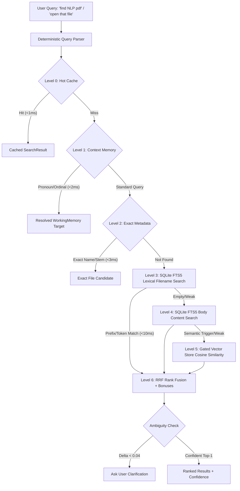

# JARVIS EDGE — Phase 3 File & Knowledge Intelligence

## 1. Overview & Architecture

Phase 3 introduces an ultra-fast, local-first file and knowledge retrieval engine designed for real-time responsiveness ($p95 < 20\text{ ms}$) without rescanning the physical filesystem during user requests.



---

## 2. The 6-Level Search Cascade

1. **Level 0: Bounded Hot Cache (`SearchHotCache`)**
   - 2,048-entry bounded LRU cache keyed by `(clean_text, type_hint, temporal_hint, latest, generation)`.
   - Generational invalidation: whenever files are added, modified, or deleted, `bump_generation()` purges cache entries in $O(1)$.
   - Target latency: $p95 < 1.0\text{ ms}$ (Actual: $\sim 0.10\text{ ms}$).

2. **Level 1: Conversational Context (`WorkingMemory`)**
   - Resolves natural language references without disk crawl:
     - Pronouns: `"open that file"`, `"that document"` $\rightarrow$ resolves to last opened file or last search Top-1.
     - Ordinals: `"the first one"`, `"the second one"`, `"the last one"` $\rightarrow$ indexed selection from previous result set.
     - Type filters: `"open the pdf"`, `"that document"` $\rightarrow$ selects matching extension from active session context.
     - Folder references: `"open that folder"`, `"same folder"` $\rightarrow$ resolves to directory of current context.
   - Target latency: $p95 < 2.0\text{ ms}$ (Actual: $\sim 0.13\text{ ms}$).

3. **Level 2: Exact Filename Metadata Lookup**
   - Direct SQLite index lookup against `files(name_norm)` and `files(stem)`.
   - Resolves direct filename queries like `"classifier.py"`, `"resume.pdf"` with zero full-text engine overhead.
   - Target latency: $p95 < 3.0\text{ ms}$ (Actual: $\sim 1.5\text{ ms}$).

4. **Level 3: FTS5 Lexical Filename & Path Search**
   - Backed by SQLite FTS5 prefix virtual table with tokens indexed at prefixes 2, 3, and 4.
   - Custom BM25 column weighting:
     $$\text{Weight}(\text{name}) = 10.0, \quad \text{Weight}(\text{stem}) = 5.0, \quad \text{Weight}(\text{path\_tokens}) = 2.0, \quad \text{Weight}(\text{content}) = 1.0$$
   - Target latency: $p95 < 10.0\text{ ms}$ (Actual: $\sim 3.8\text{ ms}$).

5. **Level 4: FTS5 Body Content Search**
   - Automatically queried when lexical filename search returns fewer than 3 candidates or when the query mentions concepts in document bodies.
   - Extracts and indexes content from `.txt`, `.md`, code files, `.docx` (via stdlib XML), and `.pdf` (via `pypdf`).

6. **Level 5: Gated Semantic Search (`VectorStore`)**
   - Isolated behind the `VectorStore` protocol (`SQLiteVecStore` with in-memory cosine fallback).
   - Only executed if semantic trigger phrases are detected (`"explaining"`, `"discussing"`, `"concept of"`) or lexical results are empty.
   - System operates with 100% functionality even when Ollama is offline.

7. **Level 6: Hybrid Rank Fusion & Ambiguity Detection**
   - Reciprocal Rank Fusion (RRF with $k=60$):
     $$\text{RRF\_Score} = \frac{1}{60 + \text{Rank}_{\text{lexical}}} + \frac{1}{60 + \text{Rank}_{\text{semantic}}}$$
   - Capped heuristic bonuses:
     - Exact name / stem match: $+0.35$
     - Name prefix match: $+0.20$
     - File type match: $+0.15$ (penalty $\times 0.60$ for mismatched extension)
     - Recency bonus: $+0.10$ for $< 24\text{ hours}$, $+0.05$ for $< 7\text{ days}$
     - Usage frequency boost: $\min(+0.10, \text{open\_count} \times 0.02)$
     - Context reference bonus: $+0.15$
   - Ambiguity detection: If $| \text{Score}_1 - \text{Score}_2 | < 0.04$, flags `is_ambiguous = True` and prompts clarification.

---

## 3. Database Schema (`003_search_index.sql`)

- `files`: Metadata records (`path`, `name`, `stem`, `extension`, `size_bytes`, `modified_ns`, `open_count`, `last_opened_ns`).
- `file_content`: Enriched text records (`content_text`, `content_excerpt`, `content_hash`, `extractor`, `extract_status`).
- `files_fts`: FTS5 virtual table indexing `name`, `stem`, `path_tokens`, `content` with `prefix='2 3 4'`.

---

## 4. Native File Tools

| Tool Name | Risk Level | Description |
|---|---|---|
| `find_file` | `READ_ONLY` | Cascaded multi-tier file search returning structured candidates |
| `open_file` | `REVERSIBLE` | Opens validated file via default Windows association and increments `open_count` |
| `read_file_metadata` | `READ_ONLY` | Reads file size, ISO timestamps, and MIME types |
| `create_folder` | `REVERSIBLE` | Creates directory structure safely |
| `copy_file` | `REVERSIBLE` | Copies files with metadata preservation |
| `move_file` | `REVERSIBLE` | Moves files or directories |
| `rename_file` | `REVERSIBLE` | Renames files without path change |
| `delete_file` | `DESTRUCTIVE` | Safe deletion via Windows Recycle Bin (`send2trash`) |

---

## 5. Verification & Commands

- **Run Unit & Integration Tests**:
  ```powershell
  pytest jarvis/tests/test_search.py -v
  ```
- **Run Phase 3 Demonstration**:
  ```powershell
  python scripts/demo_phase3.py
  ```
- **Run Search Performance Benchmark**:
  ```powershell
  python scripts/bench_search.py --queries 500 --scale 10000
  ```
- **Run Vector & Embedding Benchmark**:
  ```powershell
  python scripts/bench_embeddings.py
  ```
- **CLI Search Inspection**:
  ```powershell
  python -m jarvis.scripts.search_debug "find NLP pdf"
  python -m jarvis.report search
  ```
