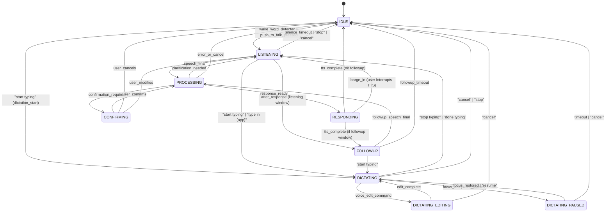

# VOICE OPERATOR STATE MACHINE — JARVIS EDGE v1.x

> Generated: 2026-09-24
> Dependencies: DESKTOP_OPERATOR_AUDIT.md, DESKTOP_CAPABILITY_CATALOG.md
> Purpose: Define the complete voice interaction state machine including
> dictation controller, focus guard, and mode transitions.

---

## 1. TOP-LEVEL VOICE STATES



---

## 2. DICTATION CONTROLLER STATE MACHINE

### 2.1 States

```
IDLE        → No dictation active. All speech routes to router.
ARMED       → Dictation requested, finding and verifying target focus.
DICTATING   → Active dictation. Stable-partial tokens bypass router.
EDITING     → Voice edit command in progress (backspace, replace, etc).
PAUSED      → Focus lost or user paused. Buffer held, no commit.
CODE_MODE   → Active code dictation (indent, outdent, symbols).
STOPPING    → Cleanup in progress (flush buffer, release focus).
```

### 2.2 Transitions

```
IDLE → ARMED:
  trigger: dictation.start command
  action: resolve DictationTarget, begin focus verification

ARMED → DICTATING:
  trigger: focus verified on target control
  action: play earcon "typing mode", start STT stabilizer session

ARMED → IDLE:
  trigger: focus verification failed (3 retries)
  action: speak "Could not find typing area in {app}"

DICTATING → DICTATING:
  trigger: stable_partial_update from STT Stabilizer
  action: compute delta, type delta via input_layer, update committed_text

DICTATING → EDITING:
  trigger: classifier detects voice edit command
  action: pause typing, execute edit action

EDITING → DICTATING:
  trigger: edit complete
  action: resume typing

DICTATING → PAUSED:
  trigger: FocusGuard.focus_lost OR user says "pause"
  action: play earcon "paused", buffer uncommitted text

PAUSED → DICTATING:
  trigger: focus restored OR user says "resume"
  action: play earcon "resumed", re-verify target, continue

PAUSED → IDLE:
  trigger: 30s timeout OR user says "cancel" / "stop"
  action: discard buffer, play earcon "typing cancelled"

DICTATING → CODE_MODE:
  trigger: user says "code mode" / "coding mode"
  action: switch formatter to code punctuation rules

CODE_MODE → DICTATING:
  trigger: user says "normal mode" / "stop code mode"
  action: switch back to natural language formatter

DICTATING → STOPPING:
  trigger: user says "stop typing" / "done typing" / "done"
  action: flush remaining buffer, commit final text

STOPPING → IDLE:
  trigger: buffer flushed
  action: play earcon "typing done", clear DictationTarget
```

### 2.3 DictationTarget Model

```python
@dataclass
class DictationTarget:
    """Tracks the target for active dictation."""
    app_name: str                    # "Notepad", "Chrome", "VS Code"
    window_title: str                # Full window title
    window_hwnd: int                 # Win32 window handle
    control_id: str = ""             # UIA automation_id if targeting specific control
    control_name: str = ""           # UIA name if targeting specific control
    focus_verified: bool = False     # True after initial focus check
    started_at: float = 0.0         # time.time() of dictation start
    total_committed: int = 0        # Characters committed so far
    last_focus_check: float = 0.0   # Last time focus was verified
    mode: str = "normal"            # normal | code | spelling | number
```

### 2.4 Dictation Data Flow

```
                                    ┌─ NOT in DICTATING state ─┐
                                    │    Normal router path     │
AudioHub → VAD → STT → Stabilizer ─┤                           │
                                    │    IN DICTATING state     │
                                    └─ Classifier ─┬─ COMMAND ─→ Router
                                                   │
                                                   └─ TEXT ──→ DictationController
                                                                    │
                                                              FocusGuard.verify()
                                                                    │
                                                              format_dictation()
                                                                    │
                                                              input_layer.type_text()
```

### 2.5 Command vs Dictation Classifier

During active dictation, all incoming stable text is classified:

**COMMAND patterns** (always route to router):
- Voice edit: "backspace", "delete word", "undo", "redo"
- Punctuation mode: "new line", "new paragraph", "period", "comma", "question mark"
- Mode control: "stop typing", "pause", "code mode", "spelling mode", "number mode"
- System: "stop", "cancel", "hey jarvis"

**TEXT patterns** (commit as typed text):
- Everything else during active DICTATING state

**Classification rules**:
1. Check exact match against COMMAND patterns (case-insensitive)
2. If wake word detected → always COMMAND (exits dictation)
3. If match score < 0.85 for any command → TEXT
4. Ambiguous → TEXT (safe default, user can undo)

---

## 3. FOCUS GUARD

### 3.1 FocusGuard Model

```python
class FocusGuard:
    """Verifies and monitors window/control focus for safe input delivery."""

    def __init__(self, target: DictationTarget, check_interval_ms: int = 500):
        self.target = target
        self.check_interval_ms = check_interval_ms
        self.is_focused = False
        self.last_check = 0.0

    def verify_focus(self) -> bool:
        """Check if target window/control still has focus.
        
        Returns True if focus is verified, False if lost.
        Uses: GetForegroundWindow() + GetWindowThreadProcessId()
        """
        ...

    def on_focus_lost(self) -> str:
        """Called when focus check fails.
        
        Returns: 'PAUSE' | 'ABORT'
        - PAUSE if focus lost to different app
        - ABORT if target window closed
        """
        ...

    def attempt_refocus(self) -> bool:
        """Try to restore focus to target window.
        
        Uses bring_to_front() with bounded retry.
        Returns True if focus restored.
        """
        ...
```

### 3.2 Focus Check Frequency

| State | Check Frequency | On Failure |
|---|---|---|
| ARMED | Every 100ms (fast startup) | ARMED → IDLE after 3s |
| DICTATING | Every 500ms | DICTATING → PAUSED |
| EDITING | Every 200ms (sensitive) | EDITING → PAUSED |
| CODE_MODE | Every 500ms | CODE_MODE → PAUSED |
| PAUSED | Every 1000ms | Check if window restored |

---

## 4. VOICE PIPELINE INTEGRATION

### 4.1 Mode-Aware Pipeline

The existing `VoicePipeline` (`core/audio/pipeline.py`) is extended with mode awareness:

```python
class VoicePipelineMode(StrEnum):
    COMMAND = "COMMAND"       # Normal: STT → Router → Tool → Response
    DICTATION = "DICTATION"   # Typing: STT → Classifier → (Text→Type | Command→Router)
    FOLLOWUP = "FOLLOWUP"     # After response: listening window for follow-up
```

### 4.2 Pipeline State Transitions

```
VoicePipeline receives from AudioHub:
  - VAD events (speech_start, speech_end)
  - Wake word events
  - PTT events (push_to_talk_start, push_to_talk_end)

VoicePipeline decides routing based on:
  1. Current pipeline mode (COMMAND | DICTATION | FOLLOWUP)
  2. If DICTATION → delegate to DictationController
  3. If COMMAND → delegate to Router
  4. If FOLLOWUP → treat as new command in context
```

### 4.3 Barge-In Handling

When user speaks during TTS playback:
1. TTS is interrupted immediately (existing `barge_in` logic)
2. STT captures user speech
3. If in DICTATION mode → classify and route
4. If in COMMAND mode → treat as new command (ignore interrupted response)

---

## 5. INTERACTION LOOP BOUNDS

All interaction paths are bounded:

| Path | Max Steps | Max Replans | Max Latency |
|---|---|---|---|
| Voice Command → Execution | 12 steps | 2 | 10s |
| UI Click → Verify | 1 step | 0 | 2s |
| Dictation commit (per partial) | 1 step | 0 | 50ms |
| Focus verify | 1 step | 0 | 10ms |
| Focus refocus attempt | 3 retries | 0 | 3s |
| Dictation pause timeout | — | — | 30s |
| Followup listening window | — | — | 5s |

---

## 6. EARCON EVENTS

| Event | Earcon | Duration |
|---|---|---|
| `dictation.start` | Ascending tone | 200ms |
| `dictation.pause` | Descending tone | 200ms |
| `dictation.resume` | Ascending tone | 150ms |
| `dictation.stop` | Double tone | 300ms |
| `dictation.mode_change` | Click | 100ms |
| `focus.lost` | Low beep | 200ms |
| `focus.restored` | High beep | 150ms |
| `command.recognized` | Existing PULSE ack | — |
| `error.unrecoverable` | Existing PULSE error | — |

---

## 7. SAFETY INVARIANTS

1. **NEVER type into unknown window** — FocusGuard must verify before every commit
2. **NEVER bypass PolicyEvaluator** — Dictation text is typed, not executed
3. **NEVER execute clipboard content** — Clipboard is read-only for intelligence, paste is user-initiated
4. **NEVER commit to password field** — UIElement.is_password_or_credential() check
5. **Always bounded** — Every loop has a max_steps, every wait has a timeout
6. **Dictation does NOT run commands** — Text is typed as-is, commands are classified and routed separately
7. **Focus loss → immediate pause** — No buffered keystrokes sent to wrong window
8. **Wake word always exits dictation** — Safety override

---

## 8. DIAGNOSTICS EVENTS

All state transitions are logged via `EventBus`:

```python
# Dictation diagnostics
event_bus.emit("dictation.state_change", {
    "from": "IDLE", "to": "ARMED",
    "target": target.app_name,
    "trigger": "voice_command"
})

event_bus.emit("dictation.commit", {
    "text_length": 42,
    "method": "unicode",
    "target": target.app_name,
    "latency_ms": 12.5,
    "focus_verified": True
})

event_bus.emit("dictation.focus_lost", {
    "target": target.app_name,
    "current_foreground": "Explorer",
    "action": "PAUSE"
})
```
